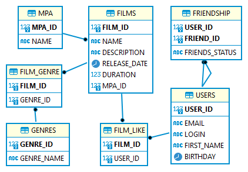

# java-filmorate application


## Пояснение к схеме

### films
Содержание информации о фильмах.
#### Таблица состоит из полей:
+ первичный ключ ```film_id``` - идентификатор фильма;
+ ```name``` - название фильма;
+ ```description``` - описание фильма;
+ ```relese_date``` - год выхода;
+ ```duration``` - продолжительность фильма в минутах;
+ внешний ключ ```genre_id``` - идентификатор жанра;
+ ```rating``` - возрастной рейтинг, например:
	 - PG - детям рекомендуется смотреть такой фильм с родителями;
	- PG-13 - детям до 13 лет смотреть такой фильм нежелательно.

### genre
Содержит информацию о жанрах кино.
#### В таблицу входят поля:
+ первичный ключ ```genre_id``` - идентификатор жанра;
+ ```name``` - название жанра.

### likes
Содержит информацию о лайках к фильмам которые поставили пользователи.
#### В таблицу входят поля:
+ первичный ключ ```film_id``` - идентификатор фильма;
+ вторичный ключ ```likesbyuser_id``` - лайки по идентификатору пользователя.

### friends
Содержит информацию о статусе заявок в друзья.
#### В таблицу входят поля:
+ первичный ключ ```user_id``` - идентификатор пользователя;
+ ```friend_id``` - идентификатор пользователя для дружбы;
+ ```friends_status``` - статус подтверждения добавления в друзья.

### users
Содержит данные о пользователях.
#### Таблица включает поля:
+ первичный ключ ```user_id``` - идентификатор пользователя;
+ ```email``` - электронная почта;
+ ```login``` - имя авторизации пользователя;
+ ```first_name``` - имя пользователя;
+ ```birthday``` - дата рождения пользователя.


##Примеры запросов приложения:
+ Добавить поле genre к таблице movie и вывести информацию о фильмах.
```
SELECT *
FROM films AS m
INNER JOIN genre AS g ON m.genre_id=g.genre_id;
```

+ Узнать топ 20 фильмов по количеству лайков.
```
SELECT m.name, 
       COUNT(l.user_id) AS count_likes
FROM films AS m
INNER JOIN likes AS l ON m.film_id=l.film_id
GROUP BY m.name
ORDER BY count_likes DESC
LIMIT 20; 
```

+ Узнать топ 10 пользователей с максимальным количеством друзей
```
SELECT u.first_name, 
       COUNT(fL.user_id) AS count_friends
FROM users AS u
INNER JOIN friends AS f ON u.user_id=f.user_id
WHERE friends_status = 'true'
GROUP BY u.first_name
ORDER BY count_friends DESC
LIMIT 10; 
```


